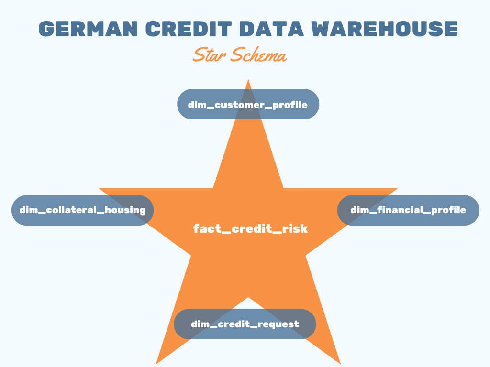
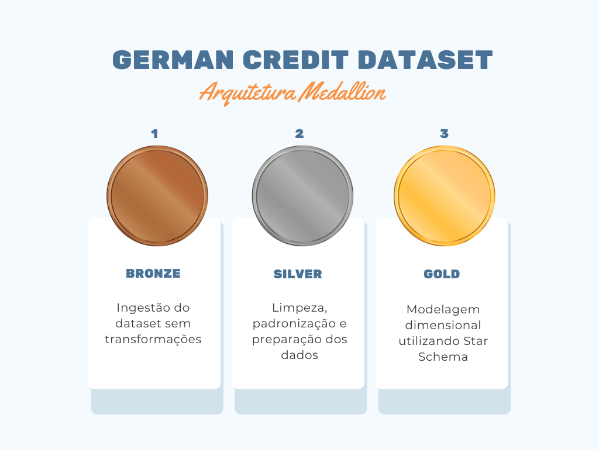

# German Credit Data Warehouse

## 🇺🇸 English

This project builds a Data Warehouse using the German Credit dataset.

The objective is to simulate a real-world data engineering pipeline using a Medallion Architecture.

Architecture used:

Bronze → Silver → Gold

### Bronze Layer
Raw data ingestion from the original dataset.

### Silver Layer
Data cleaning, type conversion, and feature preparation.

### Gold Layer
Dimensional modeling using a Star Schema.

---

## Data Architecture

---

## Data Warehouse Model

---

## Tables Created

### Dimensions
- dim_customer_profile
- dim_financial_profile
- dim_credit_request
- dim_collateral_housing

### Fact Table
- fact_credit_risk

---

## Technologies Used

- SQL
- MySQL
- Git
- GitHub

---

## Dataset Source

UCI Machine Learning Repository — German Credit Dataset.

---

# 🇧🇷 Português

Este projeto constrói um Data Warehouse utilizando o dataset German Credit.

O objetivo é simular um pipeline real de engenharia de dados utilizando arquitetura Medallion.

Arquitetura utilizada:

Bronze → Silver → Gold

### Camada Bronze
Ingestão dos dados brutos do dataset original.

### Camada Silver
Limpeza dos dados, conversão de tipos e preparação das variáveis.

### Camada Gold
Modelagem dimensional utilizando Star Schema.

---

## Arquitetura de Dados

---

## Modelo do Data Warehouse

---

## Tabelas Criadas

### Dimensões
- dim_customer_profile
- dim_financial_profile
- dim_credit_request
- dim_collateral_housing

### Tabela Fato
- fact_credit_risk

---

## Tecnologias Utilizadas

- SQL
- MySQL
- Git
- GitHub

---

## Fonte do Dataset

UCI Machine Learning Repository — German Credit Dataset.
